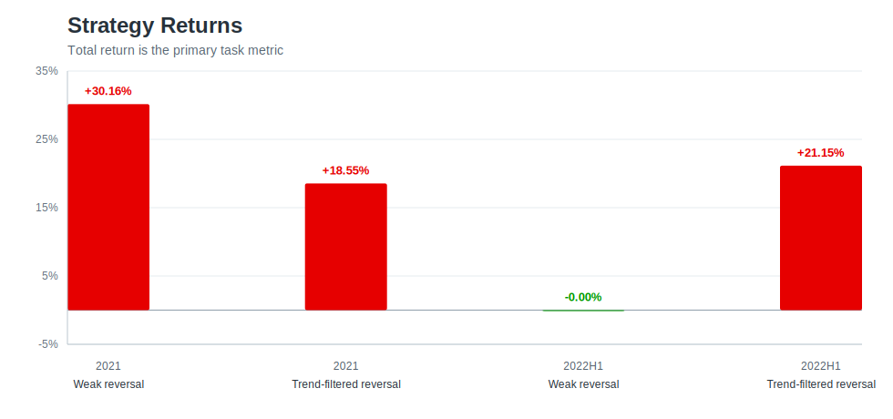
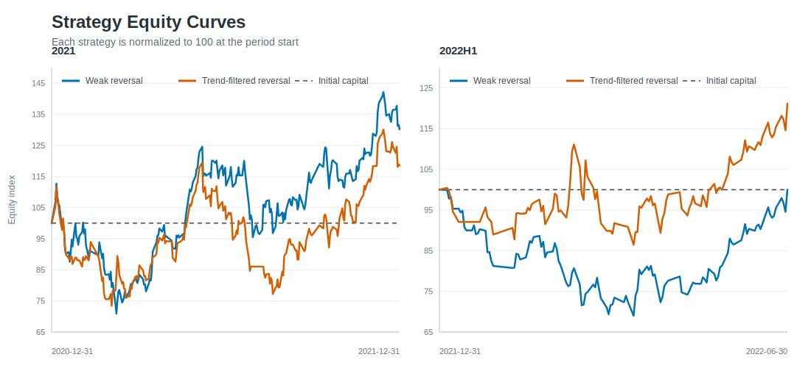
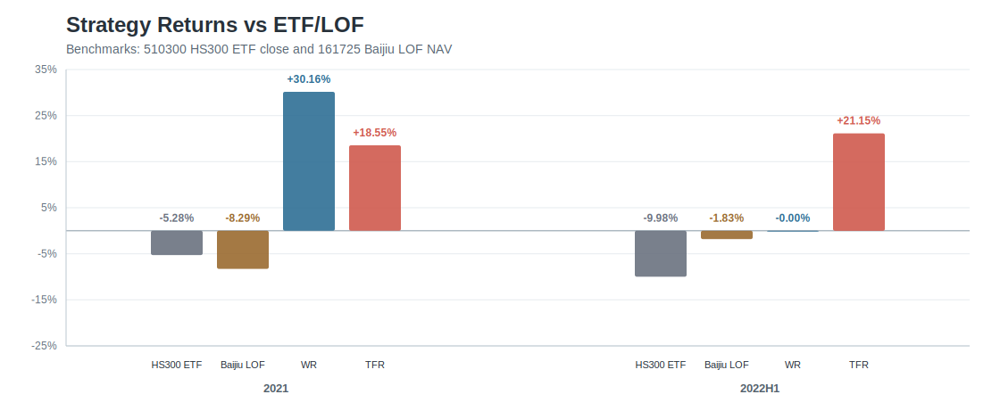
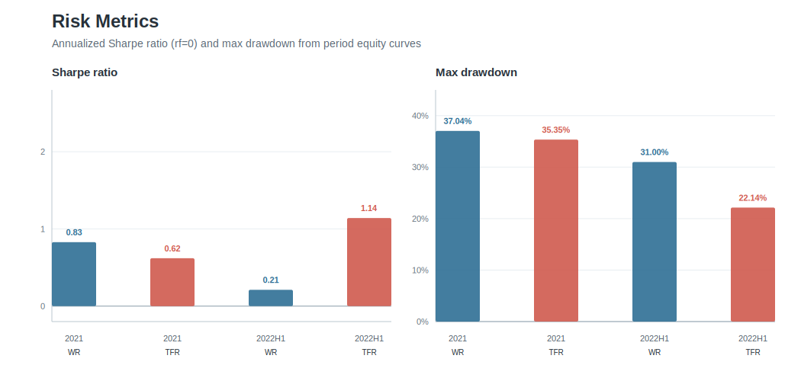
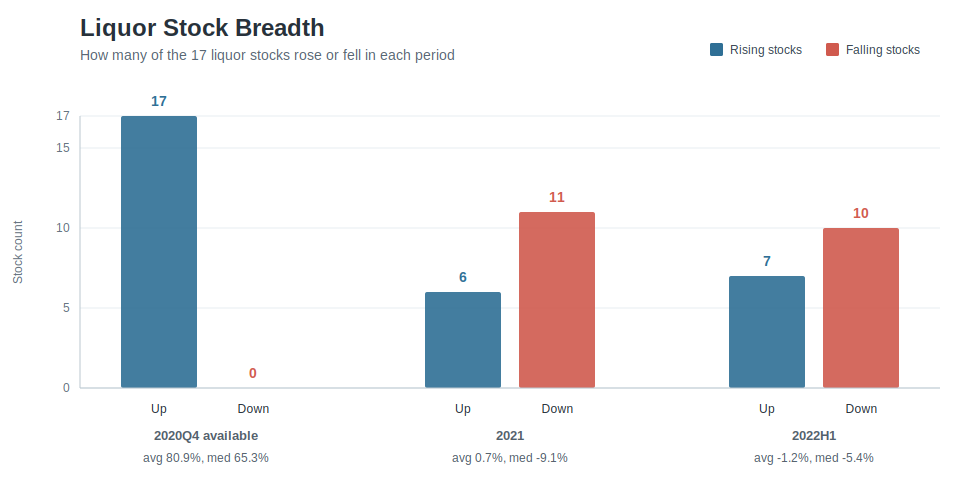

# Toy Quant Project

白酒股 AKQuant 回测项目。核心策略：每天尾盘卖出前一日持仓，再买入近 10 个交易日涨幅最低的 5 只白酒股。回测：复利回测两个区间的收益率。

## 结论

题目要求的 `weak reversal` 策略收益率为：

| 策略 | 区间 | 期初资金 | 期末权益 | 收益率 |
| --- | --- | ---: | ---: | ---: |
| weak reversal | 2020-12-31 到 2021-12-31 | 1,000,000 | 1,301,607 | 30.1607% |
| weak reversal | 2021-12-31 到 2022-06-30 | 1,000,000 | 999,952 | -0.0048% |

加入趋势过滤后的 `tf_reversal` 策略后：

| 策略 | 区间 | 策略收益率 | 沪深300ETF 510300 | 中证白酒LOF 161725 | 超额 vs 510300 | 超额 vs 161725 | Sharpe | 最大回撤 |
| --- | --- | ---: | ---: | ---: | ---: | ---: | ---: | ---: |
| weak reversal | 2021 | 30.16% | -5.28% | -8.29% | 35.44% | 38.45% | 0.83 | 37.04% |
| tf_reversal | 2021 | 18.55% | -5.28% | -8.29% | 23.82% | 26.84% | 0.62 | 35.35% |
| weak reversal | 2022H1 | -0.00% | -9.98% | -1.83% | 9.98% | 1.82% | 0.21 | 31.00% |
| tf_reversal | 2022H1 | 21.15% | -9.98% | -1.83% | 31.14% | 22.98% | 1.14 | 22.14% |

Equity curve 是账户权益曲线，即每天的现金加持仓市值之和。这里把每个区间期初账户权益归一化为 100，只比较两个策略自身资金曲线；ETF/LOF 基准对比单独放在下一张图。

这里 `weak reversal`在两个区间最大回撤都超过 30%，说明它虽然 2021 年收益高，但持有体验和风险并不温和；
`tf_reversal` 在 2022H1 的年化 Sharpe 更高、最大回撤更低，说明趋势过滤改善了弱行情中的风险收益比。

## 基准对比

投资策略需要和基准比较，否则收益率本身很难判断好坏。这里使用两个可投资产品：

- `510300` 沪深300ETF华泰柏瑞：跟踪沪深300指数。沪深300是宽基指数，由沪深市场中规模大、流动性好的 300 只代表性证券组成，用来反映 A 股核心大盘表现。
- `161725` 招商中证白酒指数(LOF)A：跟踪中证白酒指数。中证白酒选取涉及白酒生产业务相关上市公司证券作为样本，用来代表白酒行业表现。

在本项目中，`510300` 回答“策略有没有跑赢 A 股大盘宽基 ETF”；`161725` 回答“策略有没有跑赢可投资的中证白酒产品”。
由于策略只在白酒股里交易，`161725` 是更贴近策略股票池的行业基准，`510300` 则是更通用的市场基准。

## 策略解释

weak reversal 是题目原始策略：每个交易日用 T-1 收盘价计算过去 10 个交易日涨跌幅，选择涨幅最低的 5 只股票，T 日收盘换仓，资金等权分配；停牌或无成交量股票不进入候选池，不考虑交易成本，100 股为最小交易单位。

这个策略在强势或震荡年份可以捕捉短期反转，但在板块整体转弱时容易买到持续下跌的股票。因此第二个策略命名为 `tf_reversal`，即 trend-filtered reversal：先要求近 10 日收益为正，确认股票仍处在短期正趋势里，再在这些股票中选择涨幅最低者；如果整个候选池都没有正收益股票，就卖出后持有现金，不强行抄底。

## 板块观察

这里的“白酒股票池宽度”不是全市场统计，只统计题目给出的 17 只白酒股。它回答的是：上涨或下跌是不是发生在多数股票上，而不是被少数个股拉动。

表格的计算方式是：对每只股票分别计算区间收益率 `期末前复权收盘价 / 期初前复权收盘价 - 1`，再对这 17 个收益率取平均数、中位数，并统计上涨/下跌股票数量。当前回测缓存从 2020-10-09 开始，因此 2020 段展示的是可用数据中的 2020Q4；2021 段覆盖 2021-01-04 到 2021-12-31。

| 区间 | 平均收益 | 中位数收益 | 上涨股票数 | 下跌股票数 |
| --- | ---: | ---: | ---: | ---: |
| 2020Q4 available | 80.89% | 65.30% | 17 | 0 |
| 2021 | 0.70% | -9.14% | 6 | 11 |
| 2022H1 | -1.24% | -5.40% | 7 | 10 |

图里直接展示每个区间上涨和下跌的股票数量，并在顶部标注平均收益和中位数收益。它说明 2020Q4 是普涨，17 只股票全都上涨；但 2021 年不是普涨行情，中位数收益已经转负，且 11/17 只股票下跌。这个宽度恶化解释了为什么只做“跌得多就买”的弱反转策略会暴露在持续下跌风险中，也正是 `tf_reversal` 加入正趋势过滤的动机。

## 数据与回测口径

- 数据来源：全部行情数据均通过 AKShare 获取；股票行情使用 `akshare.stock_zh_a_hist`，`510300` 使用 `akshare.fund_etf_hist_sina`，`161725` 使用 `akshare.fund_open_fund_info_em`
- 复权方式：`qfq(前复权)`
- 股票池：`000860`, `002646`, `600199`, `603919`, `000799`, `603198`, `600519`, `600559`, `002304`, `000568`, `600779`, `600809`, `000596`, `603589`, `600197`, `603369`, `000858`
- 交易假设：不考虑佣金、印花税、过户费和滑点；T 日收盘价成交；A 股 T+1；100 股为一手
- 指标口径：收益率、Sharpe 和最大回撤均按题目指定区间的 equity curve 计算
- 基准口径：`510300` 使用 ETF 二级市场收盘价；`161725` 使用基金单位净值；二者收益率均按策略相同起止日计算
- AKQuant 可视化参考：`BacktestResult.report(...)` 支持 HTML 回测报告和 benchmark 对比；本仓库额外生成 README 友好的 SVG 静态图

## Project Layout

- `src/quant/`: 核心源码，主要分为四个板块。
- 数据准备：`data_prepare.py` 负责调用 AKShare 下载 17 只白酒股的日线行情，做股票代码校验、字段标准化、前复权 OHLCV 清洗、成交量单位统一，并把原始数据缓存到本地，避免每次回测都重新请求数据。
- 策略构造：`strategy.py` 负责把行情数据转成交易信号。它计算 T-1 往前 10 个交易日的收益率，生成 `weak_reversal` 和 `tf_reversal` 两种选股表，并在 `MyStrategy` 中实现每日尾盘卖出旧持仓、按 100 股一手等权买入目标股票的调仓逻辑。
- 回测执行：`backtest.py` 和 `main.py` 负责组织完整回测流程。`backtest.py` 封装单个策略、单个区间的 AKQuant 回测，并计算期末权益、收益率、订单数量等结果；`main.py` 统一配置股票池、回测区间、初始资金、换仓参数、成交口径和两个策略，然后批量运行所有组合。
- 结果报告：`result_prepare.py` 和 `reporting.py` 负责把回测产物落盘并生成图表。`result_prepare.py` 输出收益汇总、信号表、订单、成交、权益曲线、数据质量报告和调仓记录；`reporting.py` 在这些结果基础上加入 ETF/LOF 基准、风险指标、板块宽度统计，并生成 README 中使用的 SVG 图。
- `docs/`: 任务说明、报告要求和 README 图表。
- `notebooks/`: 交互式实验 notebook。
